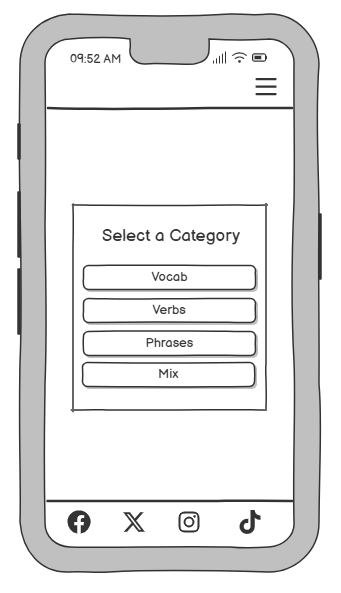
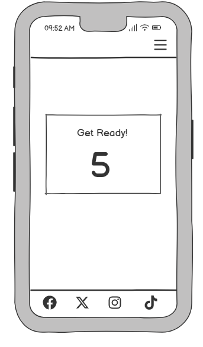
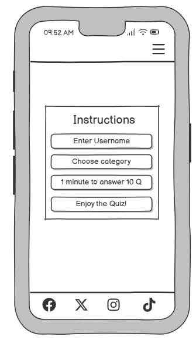
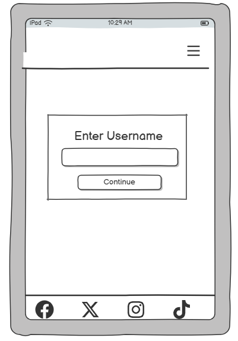
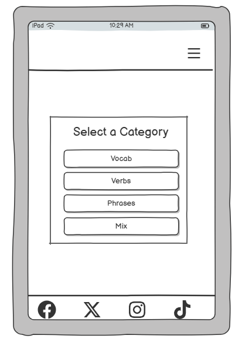
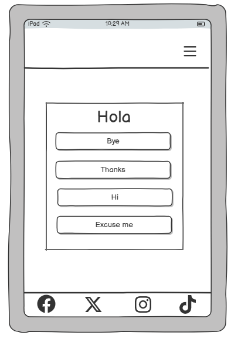
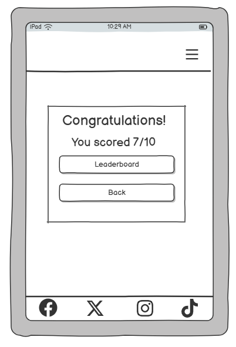
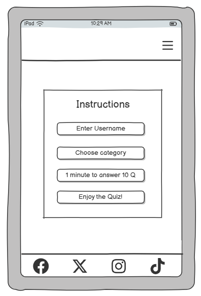
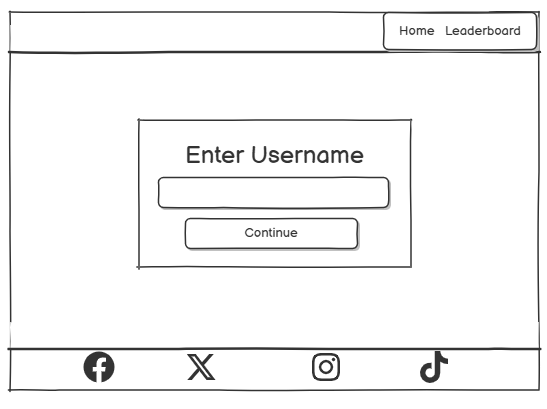
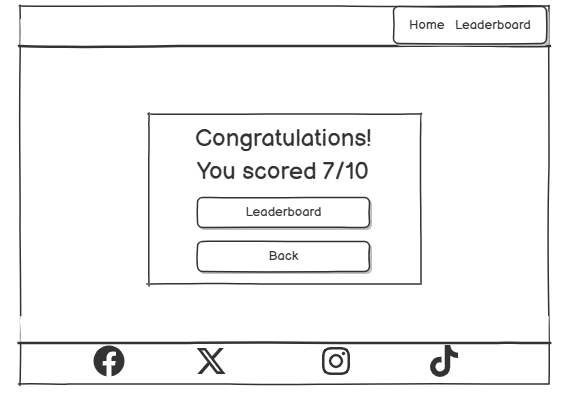

# spanish-language-quiz

## Contents

- [Project Aims](project-aims)

- [User Experience](#user-experience)
 - 
 - 

- [Design](#design)
 - 
 - 

- [Features](#features)
 - 
 - 

- [Technologies Used](#technoliges-used)
 - 
 - 

- [Testing](#testing)
 - [User Stories](#user-stories)
 - 

- [Deployment](#deployment)
 - [How to Deploy](#how-to-deploy)
 - [Local Deployment](#local-deployment)
    - [How to Fork](#how-to-fork)
    - [How to Clone](#how-to-clone)

- [Credits](#credits)
 - [Acknowledgements](#acknowledgements)

## Project Aims

## User Experience 

## Design

 The thinking behind the design of The Spanish Language Quiz was to ensure user experience was at the forefront. A single-page web application that
 was easy to follow and easy to use for a wide variety of users regardless of age or prior experience with the langauage, and of course to learn the 
 engage with the lagnauge in a fun and compettive way!

 ### Wireframes
 
 The creation of wireframes was the first element in getting this straightfroward yet engaging desing off the ground. Especially with regards to responsivenss across all devices, a clear image of what I wanted the quiz to look like on all devices really helped bring the creation to live. Wireframes were created for mobile, tablet and larger devices. 

  #### Mobile 

  The wieframes seen below were created first as a mobile-first desing approach was used throughout this project. One of the key aspects to this desing was the toggle menu in the top right corner. I know space is limited on smaller screens so I want to ensure usability. Other then this the home screen, username input and the countdonw screen stay very similar across all devices as to ensure the quiz is easy to use and understand for all participants. Follwed 

  |  |  |  |
  |---|---|---|
  | Home Screen | Username Input | Category Selection |

  Below the design can be seen for the rest of the quix flow. Again ease of use was a big factor in these design as it needed to be straightforward and not over complicated. I knew I wanted a countdown to the quiz starting to give people time to gather themselves followed by the quiz screen and finishing with the score tally and a congratulatory message.

  |  |  |  |
  |---|---|---|
  | Countdown | Quiz | Quiz End |

  Outisde of the main desing of how the quiz would flew. There was also a couple of other features that needed to be added to ensure usabilty and enjoyment. That was an instructions area and a leaderboard as seen below. 

  |  |  | 
  |---|---|
  | Instructions | Leaderboard | 

  #### Tablet 
  
  On Tablet the idea behind the design was the same as mobile knowing the space is still somewhat limited and wanting the user to not be distracted from anything outside of the quiz area. As seen in the wireframes below the layout is the same as mobile with slighlty larger screen areas for readability. Again the toggle menu was preferred here due to the limited space. 

   |  |  |  |
  |---|---|---|
  | Home Screen | Username Input | Category Selection |

  Again here as seen in the below wire wireframes, there was no amjor change behind the design og the layout. Slighlty larger boxes to fill more space but still in a concentrated area to keep all focus on the quiz.

  |  |  |  |
  |---|---|---|
  | Countdown | Quiz | Quiz End |

  The Instructions area and leaderboard were also deisgned to have the same layout as mobile.

  |  |  | 
  |---|---|
  | Instructions | Leaderboard | 

  #### Laptop & Larger Screens 
  For Laptops and larger screens the layout was desinged in a very similar way, The main difference was the change from the toggle menu to the listed items. This was done to take advtantage of the larger space. As seen in thr below wireframes, the design thought remained uncomplicated for a straightfoward and easy to follow quiz.

  |  |  | 
  |---|---|
  | Home Screen | Username Input |

  |  |  | 
  |---|---|
  | Category Selection | Quiz End |

 ### Color Scheme 
 ### Typography 
 ### Imagery 
 

## Features

## Technoliges Used

## Testing 

 ### User Stoires 

## Deployment 

 ### How to Deploy

 ### Local Deployment 

  #### How to Fork

  #### How to Clone
 
## Credits 
 
 ### Acknowledgements 

