# spanish-language-quiz

## Contents

- [Project Aims](project-aims)
  - [User Goals](#user-goals)
  - [Site Owner Goals](#site-owner-goals)

- [User Experience](#user-experience)
  - [Target Audience](#target-audience)
  - [User Requirements & Expectation](#user-requirements-&-expectations)
  - [User Stories](#user-stories)

- [Design](#design)
  - [Wireframes](#wireframes)
  - [Color Scheme](#color-scheme)
  - [Typography](#typography)

- [Features](#features)
  - [General Quiz Flow Features](general-features)
  - [Future Ideas/Potential Iplementations](general-features)

- [Technologies Used](#technoliges-used)
  - [Languages Used](languages-used)
  - [Libraries & Programmes Used](libraries)

- [Testing](#testing)
  - [W3C Validator](#w3c-validator)
  - [JavaScript Validator](#javascript-validator)
  - [Lighthouse Testing](#lighthouse-testing)
  - [Wave Web Accessibility](wave-web-accessibility)
  - [Manual Testing](#manual-testing)
  - [User Stories](#user-stories)
  - [Bugs](#bugs)

- [Deployment](#deployment)
  - [How to Deploy](#how-to-deploy)
  - [Local Deployment](#local-deployment)
     - [How to Fork](#how-to-fork)
     - [How to Clone](#how-to-clone)

- [Credits](#credits)
  - [Acknowledgements](#acknowledgements)

## Project Aims

The aim of this project was to create an interactive spanish language quiz that was user-friendly, informative and fun. 

### User Goals

 - To partake in an interactive quiz that is fun, competitive and educational.
 - Learn some key words, verbs and phrases of the spansish language.
 - Compete to better their previous scores. 

 ### Site Owner Goals
 
 - Develop a quiz game that is both fun and educational. 
 - Create suitable quiz content that is engaging and easy to follow.
 - Create a web application that is responsive across different devices. 
 - Ensure UX is a high concentration throughout the quiz flow from start to finish. 
 

## User Experience 

 ### Target Audience 
 - Users who want a quick and straightforward learning experience.
 - People of all ages who are eager to get a start on the spanish language can partake.
 - Users who want a straghtforward yet interactive app rather then overdeisigned and more diffcult to use apps.
 - Users who want to asses their general level of spanish in a quick and easy manner.

 ### User Requirements & Expectations

 - An easy to understand quiz with access to clear instructions of how to play.
 - Easy navigation from start to finish.
 - Be able to play across a variety of devices regardless of browser choice.
 - For everything to work in the correct way as its seen.
 - No issues regarding accesability.
 - Clear structure of scoring system.
 - Have a variety of categories to choose and from.

### User Stories 

User stories were created in order to highlight the essential needs that a potential user of the quiz would need. 

These will be looked at in more detail in the testing section below.

| Title                    | User Story |
|--------------------------|------------|
| **Navigation — Ease of use** | I want to be able to identify how to take part in the quiz in an easy to understand manne rwith no fuss. |
| **Assess Spanish skills**    | I want to be able to truly test my Spanish level in a fun way via the quiz. |
| **Timer**                    | I want to be able to feel the quiz environment by being under a time limit for questions. |
| **Leaderboard**             | I want to be able to see how I competed. |
| **Congratulatory message**  | I want to be made aware of when I finish the quiz in a manner that makes me feel good. |
| **Quiz score**              |  I want to be able to see my quiz score when I finish the quiz. |

## Design

 The thinking behind the design of The Spanish Language Quiz was to ensure user experience was at the forefront. A single-page web application that
 was easy to follow and easy to use for a wide variety of users regardless of age or prior experience with the langauage, and of course to learn the 
 engage with the lagnauge in a fun and compettive way!

 ### Wireframes
 
 The creation of wireframes was the first element in getting this straightfroward yet engaging desing off the ground. Especially with regards to responsivenss across all devices, a clear image of what I wanted the quiz to look like on all devices really helped bring the creation to live. Wireframes were created for mobile, tablet and larger devices. 

  #### Mobile 

  The wieframes seen below were created first as a mobile-first desing approach was used throughout this project. One of the key aspects to this desing was the toggle menu in the top right corner. I know space is limited on smaller screens so I want to ensure usability. Other then this the home screen, username input and the countdonw screen stay very similar across all devices as to ensure the quiz is easy to use and understand for all participants. Follwed 

  |  | 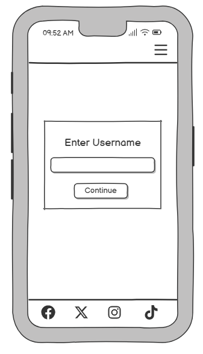 |  |
  |---|---|---|
  | Home Screen | Username Input | Category Selection |

  Below the design can be seen for the rest of the quix flow. Again ease of use was a big factor in these design as it needed to be straightforward and not over complicated. I knew I wanted a countdown to the quiz starting to give people time to gather themselves followed by the quiz screen and finishing with the score tally and a congratulatory message.

  |  |  | 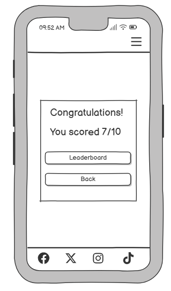 |
  |---|---|---|
  | Countdown | Quiz | Quiz End |

  Outisde of the main desing of how the quiz would flew. There was also a couple of other features that needed to be added to ensure usabilty and enjoyment. That was an instructions area and a leaderboard as seen below. 

  |  | 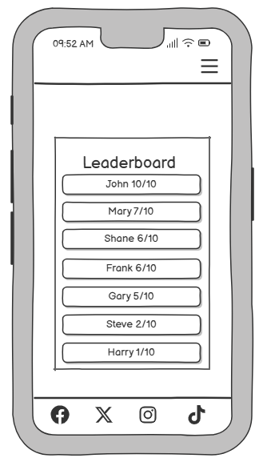 | 
  |---|---|
  | Instructions | Leaderboard | 

  #### Tablet 
  
  On Tablet the idea behind the design was the same as mobile knowing the space is still somewhat limited and wanting the user to not be distracted from anything outside of the quiz area. As seen in the wireframes below the layout is the same as mobile with slighlty larger screen areas for readability. Again the toggle menu was preferred here due to the limited space. 

   | 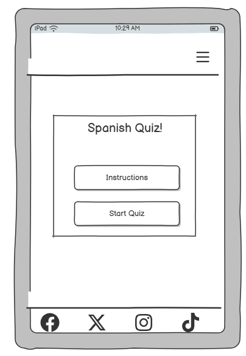 |  |  |
  |---|---|---|
  | Home Screen | Username Input | Category Selection |

  Again here as seen in the below wire wireframes, there was no amjor change behind the design og the layout. Slighlty larger boxes to fill more space but still in a concentrated area to keep all focus on the quiz.

  | 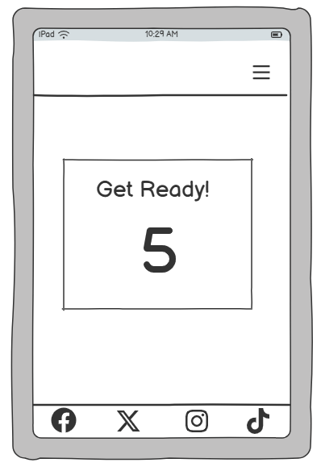 |  |  |
  |---|---|---|
  | Countdown | Quiz | Quiz End |

  The Instructions area and leaderboard were also deisgned to have the same layout as mobile.

  |  | 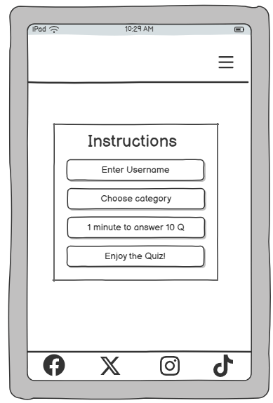 | 
  |---|---|
  | Instructions | Leaderboard | 

  #### Laptop & Larger Screens 
  For Laptops and larger screens the layout was desinged in a very similar way, The main difference was the change from the toggle menu to the listed items. This was done to take advtantage of the larger space. As seen in thr below wireframes, the design thought remained uncomplicated for a straightfoward and easy to follow quiz.

  | 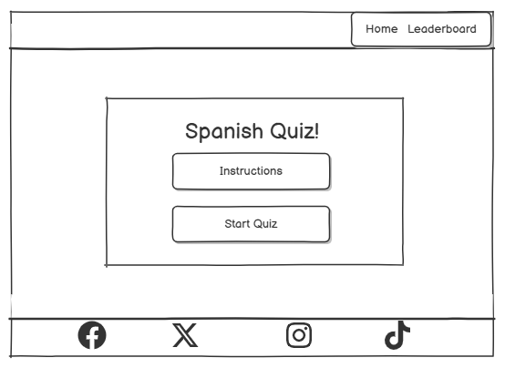 |  | 
  |---|---|
  | Home Screen | Username Input |

  | 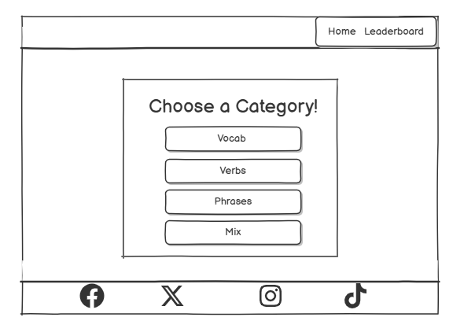 |  | 
  |---|---|
  | Category Selection | Quiz End |

 ### Color Scheme 

The Colors seen below were carefully selected in order to entertain the spanish theme of the quiz and to provide the right levels of contrats. 

The primary colors was an easy decision based on this being a spanish quiz. However the shade of red and yellow used needed to be correct in order to not over power the users and take away from the contrast of other colors that played a role. With the two primary colors being quite loud it was important the secondary colors used for buttons, social media links and menus were able to stand out. This was important due to UX and accesability. 

As seen below the two primary colors chosen were HEX colors #B12631 and #F1C40F. The secondary colors used  to compliment the promary colors were #1A252F, #ECF0F1 and #151D26. 

Color pallete created on: [Coolers](https://coolers.co/)

 ### Typography 

 A number of different font styles and combinations were tried and tested for compatibilaty. However, the two that complimented one another and were 
 suitable for both the english and spanish language were Noto Sans and Merriweather. As seen below, Nato Sans was chosen to be used as a primary font and Merriweather was chosen as a secondary font. 

 [Google fonts](https://fonts.google.com/) was used for font generation throughout the project.
 
 |  |  | 
  |---|---|
  | Typography example 1 | Typography 2 |
  
## Features

### General Features 

The general features section will focus on the quiz flow and the features at each point (On mobile). In the below table you can see two images, The first one being the home screen or landing page. This Screen is the first screen of which users see, so the emphasis was to desing a clearly structured layout with minimal distractiions.

#### Home Screen

As such you can see a footer with social media links and a header with a NAV toggle bar. The emphasis throughout this application is on the quiz flow that is deleivered through a variety of different screens. A button to see the instructions or the button below it to start the quiz are the main features here. Nice and simple to start. 

|  |  |
|---|---|
| Home Screen on mobile | Instructions Screen on mobile |

#### Username Input Screen - with minimum charecter check

After users select the Start Quiz button, the username input screen is shown. A key feature here is that the user cannot leave the field blank if they wish to continue. As well as this a username is required to be between 3 and 10 charecters long. 

|  |  |
|---|---|
| Username Screen on mobile | Username Check Screen on mobile |

#### Category Selection & Countdown Screens

After a user succesfully enters a suitable username they are brought to the category selection screen. Here its very easy to follow. The user simply selects one of 4 categorys. Vocab, Verbs, Phrases or the last option to Mix, this mixes the other 3 categorys into one.

When the user selects which category they want to play, the 5 second countdown begins.

|  |  |
|---|---|
| Category Screen on mobile | Countdown Screen on mobile |

#### Quiz Screen - Answer wrong/right & Timer/Question Counter features

When the 5 second countdown has come to an end, the quiz begins. The first image below shows the question as you see it before you make your selection. 

The following image shows the wrong answer feature, which highlgihts the wrong question selected in red and the right question in green. The third image shows the right ansewer feature which higllights your selected button in green if youve guessed correctly. 

Of course each wrong or right answer is acounted for and the counter below the answers is updated accordingly. 

|  |  |   |
|---|---|---|
| Quiz Screen on mobile | Wrong Answer on mobile | Right Answer Screen on mobile |

#### Quiz End Screen - Options to See leaderboard or return to quiz

The Quiz finishes with a message congratulating you on completing the quiz and your score/time shown also. Also shown here are 2 buttons, 1. to see the leaderboard and where you ranked and the second one to return back to the start of the quiz. 

The leaderboard ranks the top 10 participants. Although right now its really more for tracking oyur own progress or playong together on the one device with freinds as everyrthing is stored via local storage. This is something that could be implemented in the future as discussed furter below. 

|  |  |
|---|---|
| End Quiz Screen | Leaderboard Screen on mobile |

#### 404 Page 

There is also a 404 page that was created in the case of any broken links as a fall back page. 

 | 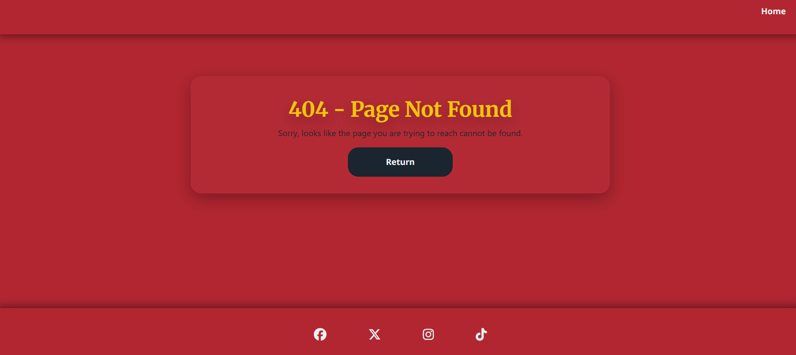 |  
  |---|
  | 404 Page foro broken links etc | 

## Technoliges Used

### Languages Used 

  - **HTML** was used throughout the website. 
  - **CSS** was used to create preffered color schemes and design layout.
  - **Javascript** was used to bring the quiz functionality to life. 

### Frameworks, Libraries & Tools

  - [Am I responsive](https://ui.dev/amiresponsive)
  - [Boostrap](https://getbootstrap.com/)
  - [Balsamiq](https://balsamiq.com/)
  - [Fireworks.js](https://fireworks.js.org/) - to create fireworks effect at end of quiz. 
  - [Favican.io](https://favicon.io/#google_vignette)
  - [Font-Awesome](https://fontawesome.com/)
  - [Chrom-Dev-Tools] - 
  - [Coolers](https://coolors.co/) 
  - [Chat-GPT](https://chatgpt.com/) - used in debugging process.
  - [Google-fonts](https://fonts.google.com/)
  - [Git](https://git-scm.com/)
  - [GitHub](https://github.com/)
  - [WC3-Validator](https://validator.w3.org/)
  - [Jigsaw-W3C-Validator](https://jigsaw.w3.org/css-validator/)
  - [JShint-Validator](https://jshint.com/)
  - [Lighthouse](https://developer.chrome.com/docs/lighthouse/overview)
  - [Wave-Validator](https://wave.webaim.org/) 

## Testing 

### W3C Validator 

#### HTML Validation 

To test the validaiton of the html code, I used the Markup Validation Service website. As seen in the image below, there were no errors.

|  |
  |---|
  | HTML Validator Confrimation Home Screen |

The 404 page was also tested as seen below.

|  |
  |---|
  | HTML Validator Confrimation 404 Page |

#### CSS Validation 

To test the validationn of the CSS code, I used The W3C CSS Validation Service.

| 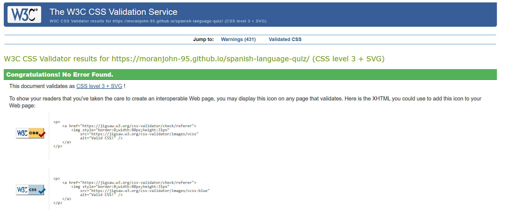 |
  |---|
  | CSS Validator Confirmation Home Screen |

The 404 page was also tested as seen below.

|  |
  |---|
  | CSS Validator Confirmation 404 Page |

### JavaScript Validator 

#### JSHint

JSHint JS Validation was used to test the validation of the Javascript code being used with no major issues showing.

The only issue was relating to the firewokrs function which was taken from an external source as referenced.

|  |
  |---|
  | JSHint Validator Confirmation Page |

### Lighthouse Testing 

Google Lighthouse testing in Google chrome developer was used to ensure overall performance and page load was in good order.

| 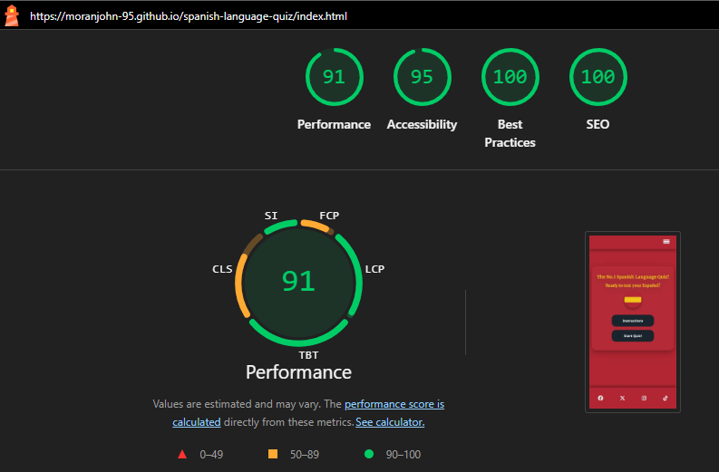 |
  |---|
  | Lighthouse Testing Confirmation |

  This was also tested for on the 404 page. 

| 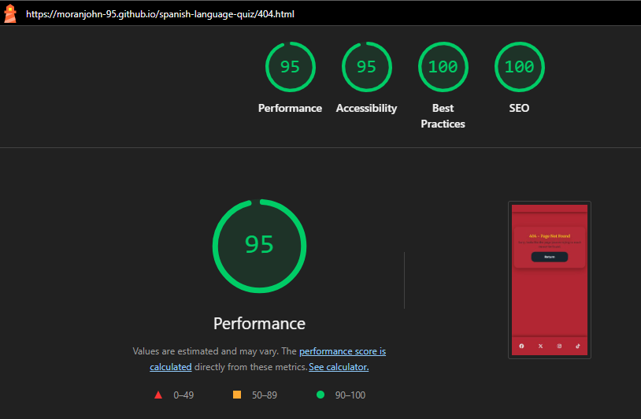 |
  |---|
  | Lighthouse Testing Confirmation 404 page |

### Wave Accessibility Testing 

The Wave accessibility tool was used to test accesability levels on both the homepage and the 404 page, as seen in the below images.

As you can see, there were no serious errors for either.

|  |  |
|---|---|
| Wave Accessibility Confirmation | Wave Accessibility Confirmation 404 Page |

 #### User Stoires 

## Deployment 

 ### How to Deploy

 ### Local Deployment 

  #### How to Fork

  #### How to Clone
 
## Credits 
 
 ### Acknowledgements 

